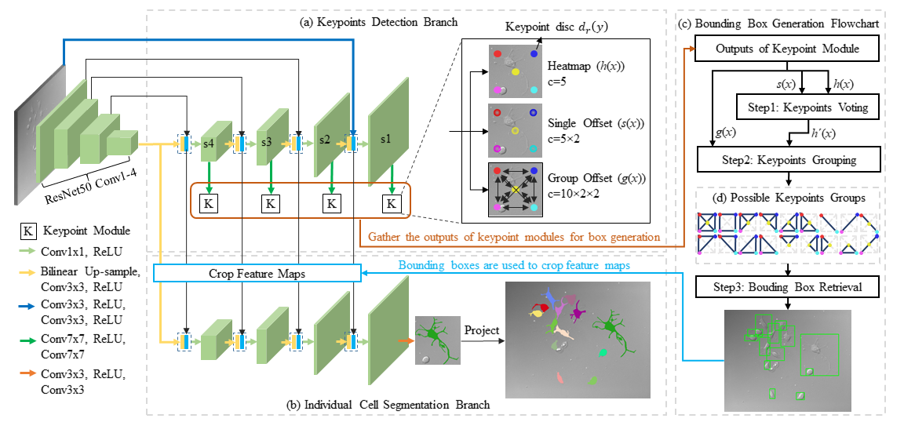
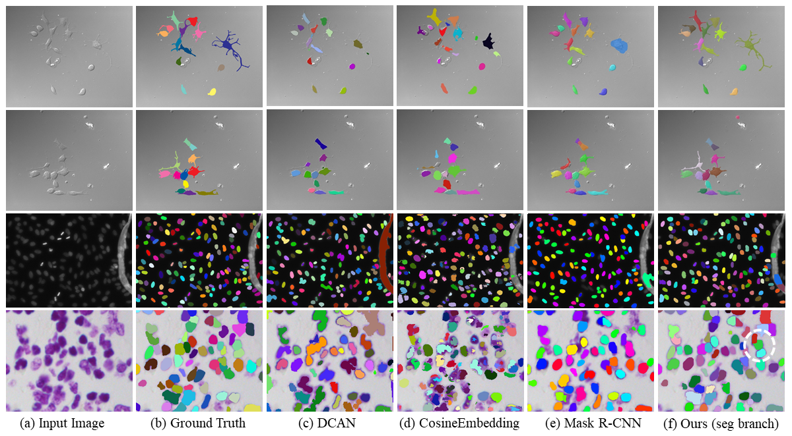

# KG_Instance_Segmentation
Multi-scale Cell Instance Segmentation with Keypoint Graph based Bounding Boxes  [Arxiv PDF Link](https://arxiv.org/abs/1907.09140)

Please cite the article in your publications if it helps your research:

	@inproceedings{YI2019MICCAI,
		author = "Jingru Yi and Pengxiang Wu and Qiaoying Huang and Hui Qu and Bo Liu and Daniel J. Hoeppner and Dimitris N. Metaxas"
		title = "Multi-scale Cell Instance Segmentation with Keypoint Graph based Bounding Boxes",
		booktitle = "MICCAI",
		year = "2019",
	}

# Introduction

Most existing methods handle cell instance segmentation problems directly without relying on additional detection boxes. These methods generally fails to separate touching cells due to the lack of global understanding of the objects. In contrast, box-based instance segmentation solves this problem by combining object detection with segmentation. However, existing methods typically utilize anchor box-based detectors, which would lead to inferior instance segmentation performance due to the class imbalance issue. In this paper, we propose a new box-based cell instance segmentation method. In particular, we first detect the five pre-defined points of a cell via keypoints detection. Then we group these points according to a keypoint graph and subsequently extract the bounding box for each cell. Finally, cell segmentation is per-
formed on feature maps within the bounding boxes. We validate our method on two cell datasets with distinct object shapes, and empirically
demonstrate the superiority of our method compared to other instance segmentation techniques.

<p align="center">
	
</p>

<p align="center">
	
</p>

# Dependencies
Ubuntu 14.04, Python 3.6.4, PyTorch 1.1.0, OpenCV-Python 4.1.0.25 

# How to start
## Train the model
```ruby
python train.py --data_dir dataPath --epochs 100 --batch_size 2 --dataset kaggle
```

## Test the model
```ruby
python test.py --resume weightPath --data_dir dataPath --save_img False --dataset kaggle
```


## Evaluate the model
```ruby
python eval.py --resume weightPath --data_dir dataPath --save_img False --dataset kaggle --eval_type seg
```

